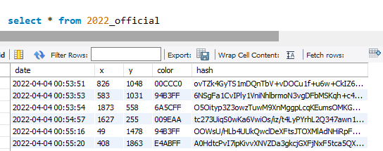
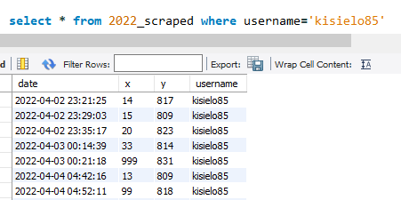
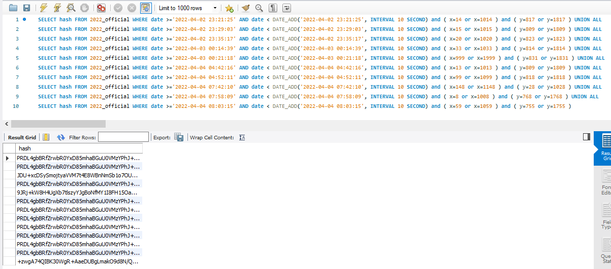
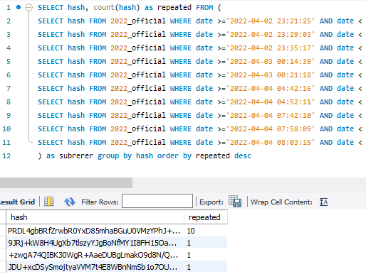
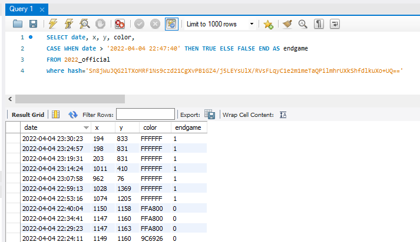
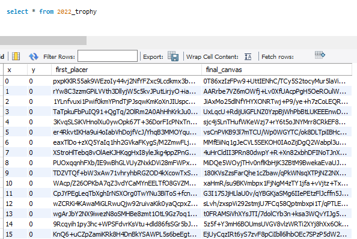
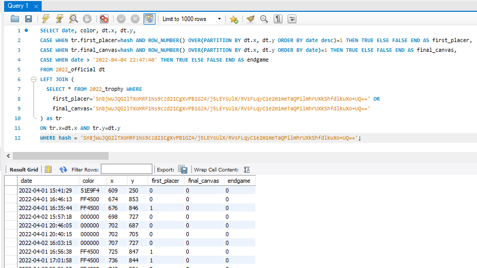

# pixel finder

**https://kisielo85.github.io/pixel_finder**<br>
**https://pixelfinder.153070065.xyz**

- [Data used](#data-used)
- [How does it work](#how-does-it-work)
- [Database](#database)
- ["user not found" ?](#user-not-found-)
- [API](#api)

this project is under development, you can check what I'm working on on my [trello board](https://trello.com/b/vH66AXR5/pixelfinderhttps:/)

## Data used

official datasets: [2017](https://www.reddit.com/r/redditdata/comments/6640ru/place_datasets_april_fools_2017/) / [2022](https://www.reddit.com/r/place/comments/txvk2d/rplace_datasets_april_fools_2022/) / [2023](https://www.reddit.com/r/place/comments/15bjm5o/rplace_2023_data/)

scraped data:

2017: [(data)](https://https://archive.org/details/place2017-opl) by [u/opl\_](https://www.reddit.com/user/opl_)

2022: [(data)](https://www.reddit.com/r/redditdata/comments/6640ru/place_datasets_april_fools_2017/) by [u/opl\_](https://www.reddit.com/user/opl_)

2023: [(data)](https://mod.ifies.com/f/230728_pixelhistory.xz) by [u/scaevolus](https://www.reddit.com/user/scaevolus) & [(data)](https://cdn.discordapp.com/attachments/297524632234229761/1133536680373133332/pixels.csv.zst) by [u/nepeat](https://www.reddit.com/u/nepeat/https:/)

for processed data and database structure, go to [Database](#database) section

## How does it work

### finding hashes

the official dataset contains all data about pixels

the thing is - you can't see who placed the pixel, there is only a hash that can't be reversed



but by using scraped data, that was collected during the event - there is a chance to find a few of your pixels



this data is not as accurate but by roughly comparing it to the official one, you get a list of possible hashes



the only thing left to do now is to get a hash that occured the most times



### trophies

endgame is by far the easiest to calculate, just check if the pixel was placed after the whiteout started



first placer and final canvas are a different story.

this script: `/_data processing scripts_/process_trophies.py` goes through every pixel placement, and for every coordinate saves first and last users that have been there



using this we can connect trophies to the query for getting pixels



this query also makes sure that only the correct pixel gets the trophy.

for example: if there are multiple pixels placed on the same cords - only the first one has a chance to get a "first placer" trophy, and only the last one can get the "final canvas"

```
SELECT date, color, dt.x, dt.y,
CASE WHEN tr.first_placer=hash AND ROW_NUMBER() OVER(PARTITION BY dt.x, dt.y ORDER BY date desc)=1 THEN TRUE ELSE FALSE END AS first_placer,
CASE WHEN tr.final_canvas=hash AND ROW_NUMBER() OVER(PARTITION BY dt.x, dt.y ORDER BY date)=1 THEN TRUE ELSE FALSE END AS final_canvas,
CASE WHEN date > '2022-04-04 22:47:40' THEN TRUE ELSE FALSE END AS endgame
FROM 2022_official dt
LEFT JOIN (
  SELECT * FROM 2022_trophy WHERE
 first_placer='Sn8jWuJQG2lTXoMRF1Ns9czd21CgXvPB1GZ4/j5LEYsUlX/RVsFLqyC1e2m1meTaQPilmhrUXkShfdlkuXo+UQ==' OR
 final_canvas='Sn8jWuJQG2lTXoMRF1Ns9czd21CgXvPB1GZ4/j5LEYsUlX/RVsFLqyC1e2m1meTaQPilmhrUXkShfdlkuXo+UQ=='
) as tr
ON tr.x=dt.x AND tr.y=dt.y
WHERE hash = 'Sn8jWuJQG2lTXoMRF1Ns9czd21CgXvPB1GZ4/j5LEYsUlX/RVsFLqyC1e2m1meTaQPilmhrUXkShfdlkuXo+UQ==';
```

_yeah, I know the hash is repeated 3 times, it's more efficient this way_

source: just trust me bro

## Database

these are the database tables along with their row counts:

- 2017_official - 16559897
- 2017_users - 1101042
- 2022_official - 160353085
- 2022_scraped - 114492522
- 2022_trophy - 4000000
- 2023_official - 132193709
- 2023_scraped - 74783143
- 2023_trophy - 6000000

all files needed are available here:

https://archive.org/details/pixel-finder

note:

this data does not contain admin rectangles etc.

### table structure

2017

```
CREATE TABLE 2017_official (
  date DATETIME,
  hash VARCHAR(30),
  x INT,
  y INT,
  color SMALLINT,
  first_placer BOOL,
  final_canvas BOOL
);

CREATE TABLE 2017_users (
  username VARCHAR(20),
  hash VARCHAR(30)
);
```

2022 / 2023

```
CREATE TABLE 2023_official (
  date DATETIME,
  x INT,
  y INT,
  color VARCHAR(6),
  hash VARCHAR(88)
);

CREATE TABLE 2023_scraped (
  date DATETIME,
  x INT,
  y INT,
  color VARCHAR(6),
  username VARCHAR(20)
);

CREATE TABLE 2023_trophy (
  x INT,
  y INT,
  first_placer VARCHAR(88),
  final_canvas VARCHAR(88)
);
```

### data import

```
LOAD DATA INFILE '/tmp/2017_official.csv'
INTO TABLE 2017_official
FIELDS TERMINATED BY ',';
```

this import works for every table, just change the file path and table name

### indexes

for a faster database, the following indexes are needed:

```
-- nick to hash search
CREATE INDEX idx_username on 2017_users(username);
CREATE INDEX idx_username on 20**_scraped(username);
CREATE INDEX idx_date on 20**_official(date);

-- getting pixels
CREATE INDEX idx_hash on 20**_official(hash);

-- trophies
CREATE INDEX idx_first_placer on 20**_trophy(first_placer);
CREATE INDEX idx_final_canvas on 20**_trophy(final_canvas);

-- hash to nick search
CREATE INDEX idx_hash on 2017_users(hash);
CREATE INDEX idx_date on 20**_scraped(date);
```

note:

**20\*\*** means that an index should be made for all matching tables

example - **20\*\*\_scraped** = **2022_scraped** & **2023_scraped**

## "user not found" ?

well, since the project relies on unofficial datasets, it just happens.

basically - the more pixels you've placed, the higher the chance of them being in unofficial datasets, and that translates to a better chance of getting the correct result

read more in the [How does it work](#how-does-it-work) section

## API

if you're not hosting pixelfinder yourself, feel free to use mine instance for any of your projects.<br>
just make sure to give me credit by adding a link to this github repo

https://pixelfinder.153070065.xyz/api?nick=kisielo85&year=23

```js
const api_link="https://pixelfinder.153070065.xyz/api"

fetch(`${api_link}?nick=${nick}&year=${year}`)
.then((response) => response.json())
.then((data) => {
    console.log(data)
}
```

if user is not found an error is returned: `{'error':'not_found'}`
otherwise, the data looks like this:

```json
{
  "hash": "KPIBp4LmRbnZNmInoufhDvNJdHwhskaB72VWY6BKy5nygN9XE6n2r/XqncgPkvl5VlZTCeiX97x+YOLh+ZF+YQ==",
  "pixels":
  [
    {
    "date":
    "2023-07-25 12:14:13",
    "color": "#D4D7D9",
    "x": 777,
    "y": -89,
    "trophy": [1]
    },
    {
    "date": "2023-07-25 12:18:22",
    "color": "#000000",
    "x": 776,
    "y": -103,
    "trophy": []
    }
  ]
}
```

trophies are represented by an array of integers:

0 - first placer

1 - final canvas

2 - endgame
